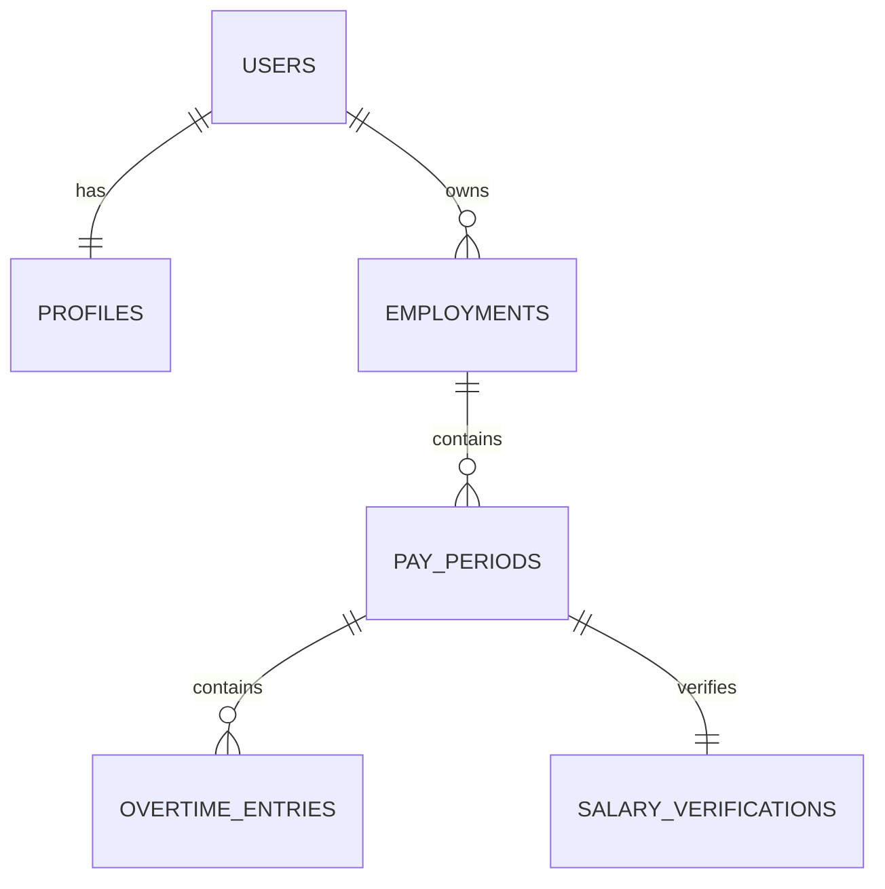

# 06_ERD.md

# 📱 Lemburin — Entity Relationship Diagram (ERD)

---

# Overview

Dokumen ini menjelaskan struktur Entity Relationship Diagram (ERD) untuk aplikasi **Lemburin**.

ERD menjadi acuan utama dalam pembuatan:

* PostgreSQL Database
* Supabase Schema
* Migration
* Row Level Security (RLS)
* API Development
* Repository Layer

Seluruh struktur database dirancang berdasarkan konsep utama aplikasi:

> **Track → Calculate → Verify**

---

# ERD Diagram



---

# Entity Overview

| Entity               | Description                                  |
| -------------------- | -------------------------------------------- |
| users                | Data autentikasi dari Supabase Auth          |
| profiles             | Informasi dasar pengguna                     |
| employments          | Riwayat pekerjaan pengguna                   |
| pay_periods          | Periode gaji aktif maupun histori            |
| overtime_entries     | Catatan aktivitas lembur                     |
| salary_verifications | Verifikasi nominal lembur terhadap slip gaji |

---

# Entity Details

## USERS

Dikelola oleh **Supabase Auth**.

### Responsibility

* Authentication
* Authorization
* Email Verification

### Primary Key

* id (UUID)

---

## PROFILES

Menyimpan informasi dasar pengguna.

### Fields

* id
* user_id
* full_name
* avatar_url
* timezone
* language
* currency
* created_at
* updated_at

### Relationship

* Satu User memiliki satu Profile.

---

## EMPLOYMENTS

Menyimpan riwayat pekerjaan pengguna.

### Fields

* id
* user_id
* company_name
* job_title
* employee_code (opsional)
* start_date
* end_date (opsional)
* is_active
* created_at
* updated_at

### Relationship

* Satu User dapat memiliki banyak Employment.
* Satu Employment dimiliki oleh satu User.

---

## PAY_PERIODS

Merupakan pusat seluruh proses pencatatan lembur.

Seluruh data lembur dikelompokkan berdasarkan periode gaji.

### Fields

* id
* employment_id
* period_name
* start_date
* end_date
* formula_type
* flat_rate_amount (opsional)
* custom_formula_config (JSONB, opsional)
* is_locked
* created_at
* updated_at

### Relationship

* Satu Employment memiliki banyak Pay Period.
* Satu Pay Period dimiliki oleh satu Employment.

---

## OVERTIME_ENTRIES

Merupakan tabel transaksi utama.

Setiap baris mewakili satu aktivitas lembur.

### Fields

* id
* pay_period_id
* work_date
* start_time
* end_time
* break_minutes
* notes
* created_at
* updated_at

### Relationship

* Satu Pay Period memiliki banyak Overtime Entry.

---

## SALARY_VERIFICATIONS

Digunakan untuk membandingkan hasil perhitungan aplikasi dengan nominal lembur pada slip gaji.

### Fields

* id
* pay_period_id
* slip_amount
* difference
* notes
* verified_at
* created_at
* updated_at

### Relationship

* Satu Pay Period memiliki maksimal satu Salary Verification.

---

# Cardinality

| Parent     | Child               | Relationship |
| ---------- | ------------------- | ------------ |
| User       | Profile             | 1 : 1        |
| User       | Employment          | 1 : N        |
| Employment | Pay Period          | 1 : N        |
| Pay Period | Overtime Entry      | 1 : N        |
| Pay Period | Salary Verification | 1 : 1        |

---

# Aggregate Root

```text
User
    │
    ▼
Employment
    │
    ▼
Pay Period
    ├──────────────┐
    ▼              ▼
Overtime Entry     Salary Verification
```

**Pay Period** merupakan **Aggregate Root** untuk seluruh data transaksi.

Semua aktivitas lembur dan proses verifikasi selalu berada di dalam satu periode gaji.

---

# Business Rules

## User

* Setiap akun memiliki satu profil.
* Pengguna hanya dapat mengakses datanya sendiri.

---

## Employment

* Satu pengguna dapat memiliki lebih dari satu riwayat pekerjaan.
* Hanya satu Employment yang dapat berstatus aktif pada satu waktu (MVP).

---

## Pay Period

* Harus dimiliki oleh satu Employment.
* Tidak boleh memiliki rentang tanggal yang saling tumpang tindih dalam Employment yang sama.
* Dapat berstatus aktif atau terkunci (`is_locked`).

---

## Overtime Entry

* Harus berada dalam rentang tanggal Pay Period.
* Jam selesai harus lebih besar dari jam mulai.
* Durasi istirahat tidak boleh bernilai negatif.
* Dapat diubah selama Pay Period belum dikunci.

---

## Salary Verification

* Maksimal satu data verifikasi untuk setiap Pay Period.
* Dilakukan setelah pengguna menerima slip gaji.
* Digunakan sebagai pembanding antara hasil perhitungan aplikasi dan nominal pada slip gaji.

---

# Data Ownership

Seluruh data dimiliki oleh pengguna yang sedang login.

Implementasi keamanan menggunakan **Supabase Row Level Security (RLS)** sehingga setiap pengguna hanya dapat:

* Melihat data miliknya sendiri.
* Menambah data miliknya sendiri.
* Mengubah data miliknya sendiri.
* Menghapus data miliknya sendiri.

---

# UUID Strategy

Seluruh tabel menggunakan **UUID** sebagai Primary Key.

Keuntungan:

* Aman untuk sinkronisasi offline.
* Tidak terjadi konflik ID saat multi-device.
* Sesuai dengan standar Supabase.

---

# Future Expansion

Struktur ERD ini dirancang agar mudah dikembangkan untuk fitur berikut tanpa mengubah relasi utama:

* OCR Slip Gaji
* Multi Device Sync
* Dashboard Statistik
* Grafik Lembur
* AI Recommendation
* Export PDF
* Export Excel
* Backup Google Drive
* Formula Tambahan
* Integrasi Kalender

---

# ERD Summary

```text
Supabase Auth
      │
      ▼
    USERS
      │
      ├──────────────┐
      ▼              ▼
 PROFILES      EMPLOYMENTS
                     │
                     ▼
               PAY_PERIODS
               ├───────────────┐
               ▼               ▼
     OVERTIME_ENTRIES   SALARY_VERIFICATIONS
```

Dokumen ini menjadi acuan utama dalam penyusunan **Database Schema (`07_DATABASE_SCHEMA.md`)**, pembuatan migration PostgreSQL, serta implementasi database di Supabase.
